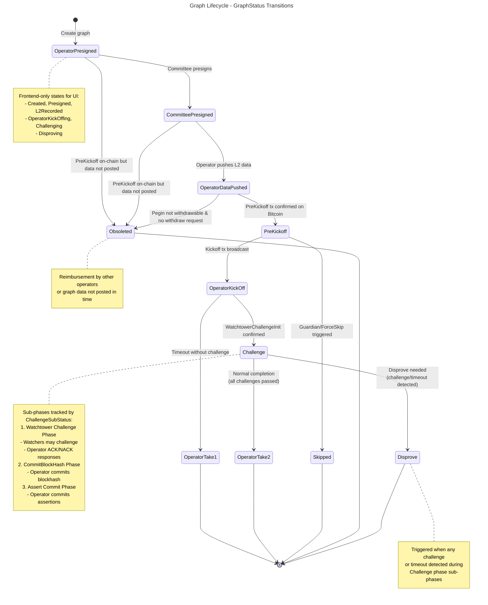
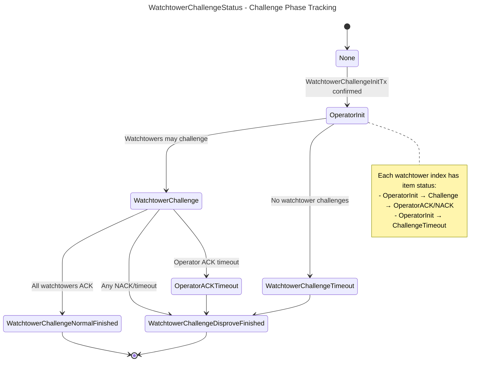
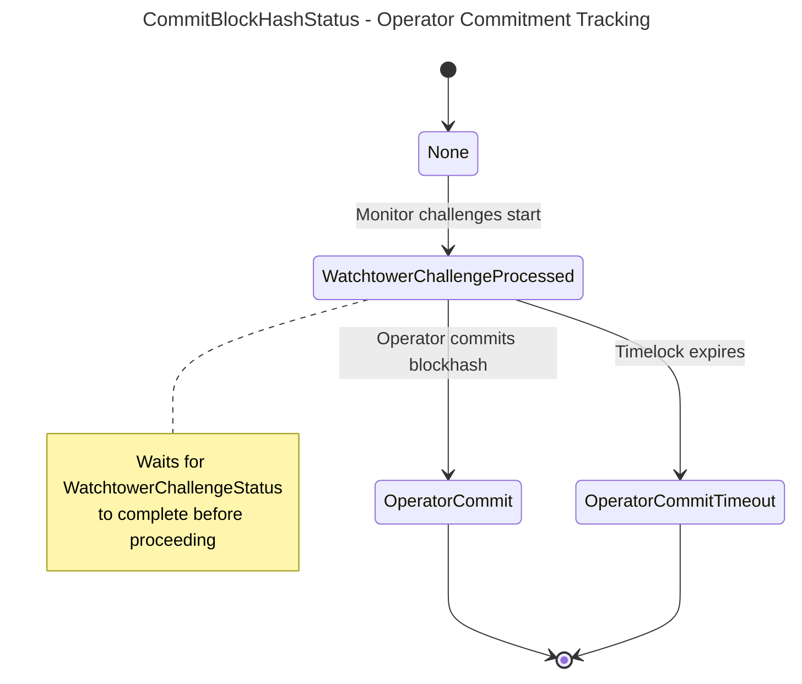
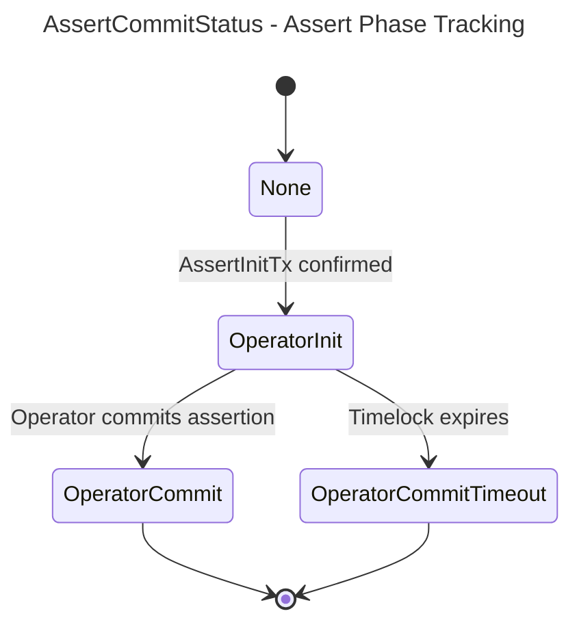
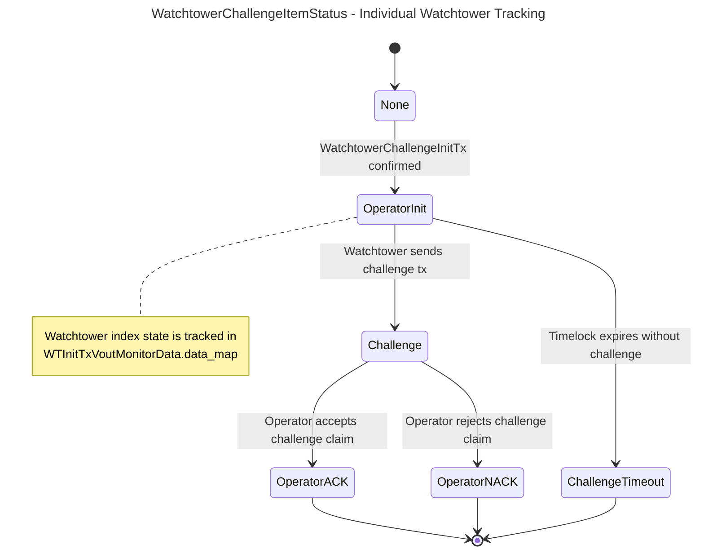

# Node

## Build

```bash
BITCOIN_NETWORK=regtest cargo build -r
```

## Graph State Machines

Based on `crates/store/src/schema.rs::GraphStatus` and `node/src/scheduled_tasks/graph_maintenance_tasks.rs`.

### Main Graph Status Transitions

From `crates/store/src/schema.rs::GraphStatus`:



### Challenge Phase: WatchtowerChallengeStatus

From `src/scheduled_tasks/graph_maintenance_tasks.rs::WatchtowerChallengeStatus`:



### Challenge Phase: CommitBlockHashStatus

From `src/scheduled_tasks/graph_maintenance_tasks.rs::CommitBlockHashStatus`:



### Challenge Phase: AssertCommitStatus

From `src/scheduled_tasks/graph_maintenance_tasks.rs::AssertCommitStatus`:



### Per-Watchtower Item Status

From `src/scheduled_tasks/graph_maintenance_tasks.rs::WatchtowerChallengeItemStatus`:



## Core Data Structures

### ChallengeSubStatus

From `src/scheduled_tasks/graph_maintenance_tasks.rs`:

```rust
pub struct ChallengeSubStatus {
    pub watchtower_challenge_status: WatchtowerChallengeStatus,
    pub commit_blockhash_status: CommitBlockHashStatus,
    pub assert_commit_status: AssertCommitStatus,
    pub disprove_type: Option<DisproveTxType>,
    pub disprove_index: i32,
}

// Helper methods:
pub fn is_watchtower_challenge_normal_finished(&self) -> bool
pub fn is_disproved(&self) -> bool
pub fn is_normal_finished(&self) -> bool
pub fn is_assert_commit_normal_finished(&self) -> bool
```

### WTInitTxVoutMonitorData

From `src/scheduled_tasks/graph_maintenance_tasks.rs`:

```rust
pub struct WTInitTxVoutMonitorData {
    pub data_map: IndexMap<i32, WatchtowerChallengeItemStatus>,
    pub require_disproved_indexes: Vec<usize>,
    pub commit_blockhash_status: CommitBlockHashStatus,
    pub is_challenge_timeout_sent: bool,
}
```

- `data_map`: Tracks status for each watchtower index
- `require_disproved_indexes`: Indices requiring disprove (populated for items in OperatorInit or Challenge status)
- `commit_blockhash_status`: Synchronized with WatchtowerChallengeStatus
- `is_challenge_timeout_sent`: Flag for timeout message tracking

### Status Enums

```rust
pub enum WatchtowerChallengeStatus {
    None,
    OperatorInit,
    WatchtowerChallenge,
    WatchtowerChallengeTimeout,
    OperatorACKTimeout,
    WatchtowerChallengeNormalFinished,
    WatchtowerChallengeDisproveFinished,
}

pub enum CommitBlockHashStatus {
    None,
    WatchtowerChallengeProcessed,
    OperatorCommit,
    OperatorCommitTimeout,
}

pub enum AssertCommitStatus {
    None,
    OperatorInit,
    OperatorCommit,
    OperatorCommitTimeout,
}

pub enum WatchtowerChallengeItemStatus {
    None,
    OperatorInit,
    Challenge,
    ChallengeTimeout,
    OperatorACK,
    OperatorNACK,
}
```

## Key Implementation Files

### Main Files

- `src/action.rs` - Message handling
  - `recv_and_dispatch()` - Routes incoming messages by type
  - Handles WatchtowerChallengeSent, OperatorAckTimeout, etc.

- `src/scheduled_tasks/graph_maintenance_tasks.rs` - Challenge phase monitoring
  - `process_watchtower_challenge_monitoring()` - Tracks watchtower challenges per index
  - `process_commit_blockhash_monitoring()` - Monitors operator blockhash commitment
  - `process_assert_commit_monitoring()` - Tracks assertion phase
  - `detect_take1()` - Checks happy path withdrawal conditions
  - `detect_take2()` - Checks disprove path withdrawal conditions

- `src/utils.rs` - Graph state updates
  - `refresh_graph()` - Scans Bitcoin and updates graph status
  - `get_watchtower_commitment()` - Fetches watchtower proofs
  - `get_operator_proof()` - Fetches operator proofs

### Data Definitions

- `crates/store/src/schema.rs` - Core enums
  - `GraphStatus` - Main graph states
  - Related `DisproveTxType`, `ProofState` enums
