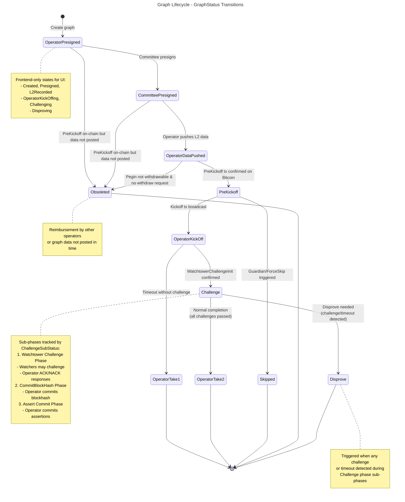
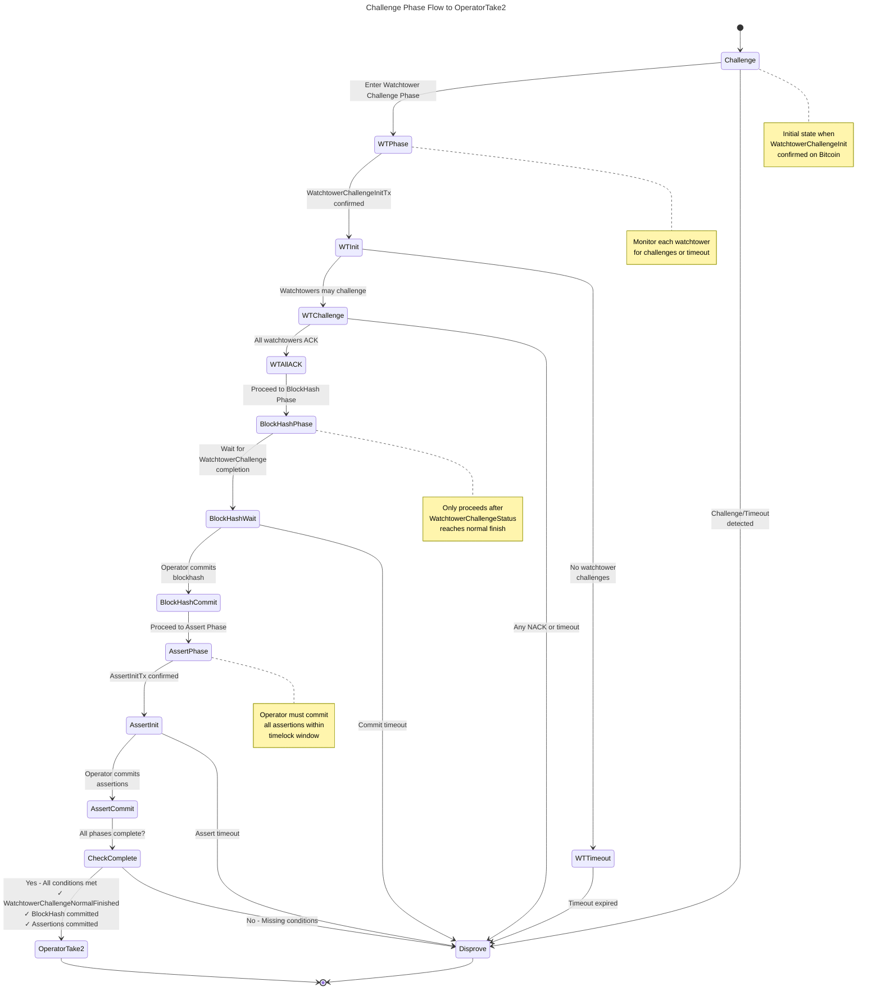
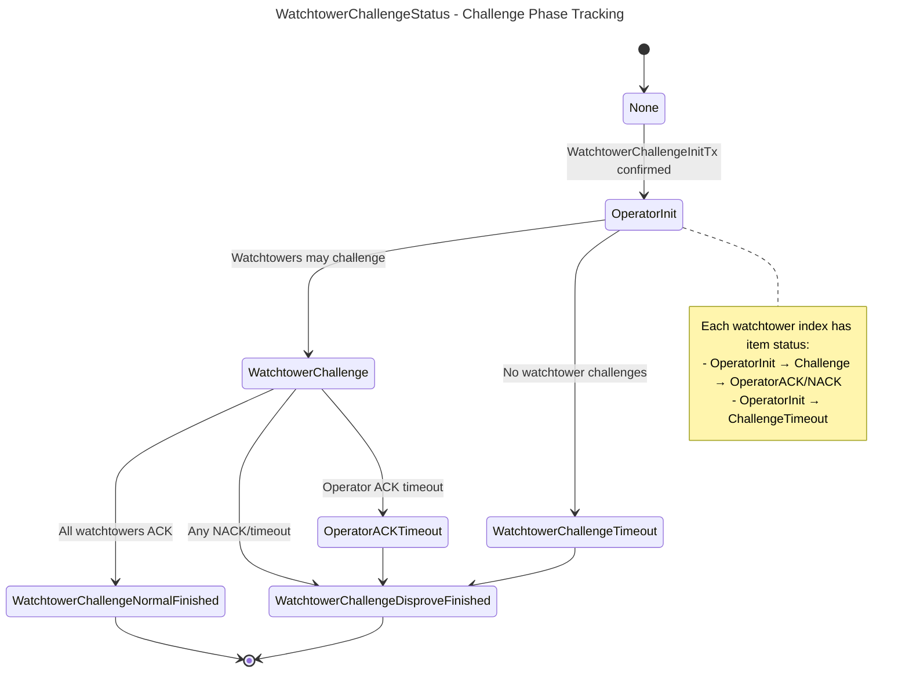
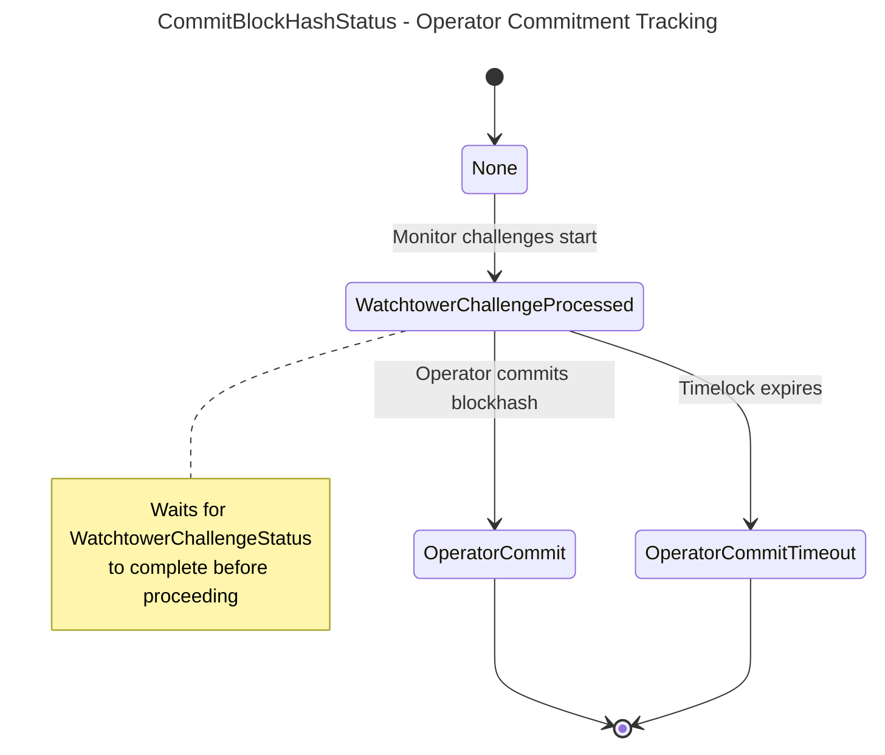
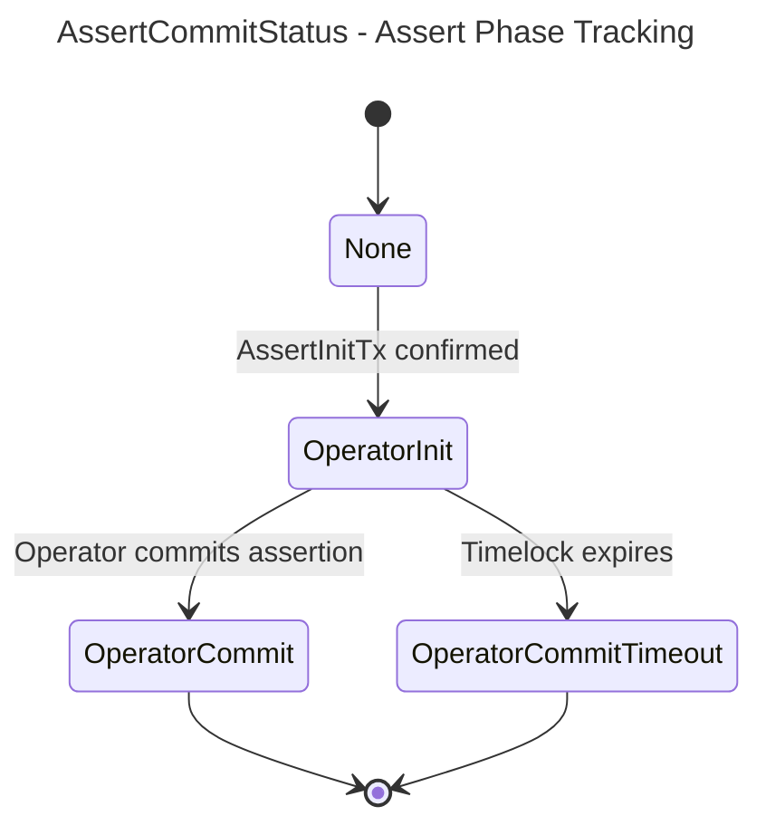
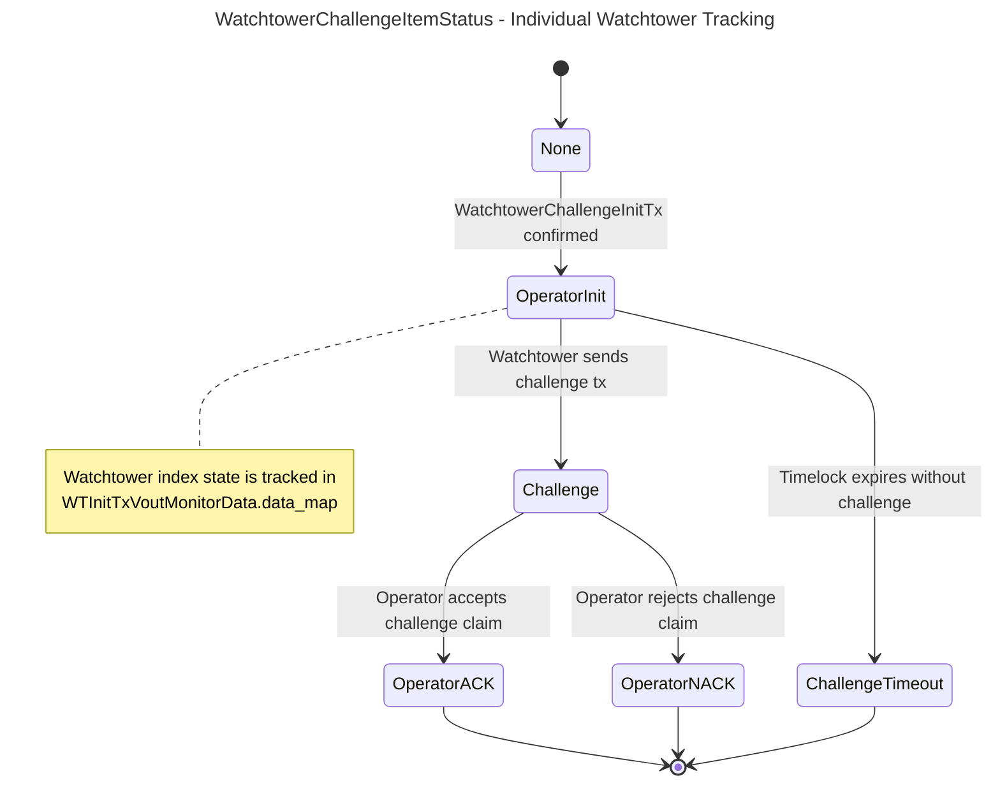

# BitVM2 Node

A distributed bridge node implementation for BitVM2, managing the complete graph lifecycle from pegin to pegout with challenge-based fraud proofs.

## Build

```bash
BITCOIN_NETWORK=regtest cargo build -r
```

## Graph State Machine

The BitVM2 node implements a state machine for managing bridge graphs that enable Bitcoin pegin/pegout operations with fraud proof guarantees. Each graph represents a pegin instance that goes through various states from creation to final withdrawal.

### Main Graph Status Transitions

Based on `crates/store/src/schema.rs::GraphStatus` and `node/src/scheduled_tasks/graph_maintenance_tasks.rs`.



### State Transition Detection

The node monitors Bitcoin transactions to detect state transitions:

- **detect_kickoff()** - `OperatorDataPushed` → `PreKickoff`: Monitors PreKickoff tx confirmation
- **detect_take1_or_challenge()** - `OperatorKickOff` → `OperatorTake1` or `Challenge`: Monitors timeout or challenge initiation
- **process_graph_challenge()** - `Challenge` → `OperatorTake2` or `Disprove`: Manages challenge sub-phases
- **detect_take1()** - Checks Take1 withdrawal conditions (happy path)
- **detect_take2()** - Checks Take2 withdrawal conditions (after challenge)

All detection runs in `graph_maintenance_tasks.rs` every 10 seconds.

### Challenge to OperatorTake2 Flow

The path from Challenge → OperatorTake2 requires successful completion of three sub-phases:



**Transition Conditions to OperatorTake2:**
- `watchtower_challenge_status == WatchtowerChallengeNormalFinished`
- `commit_blockhash_status == OperatorCommit`
- `assert_commit_status == OperatorCommit`
- `disprove_type == None` (no errors detected)

### Challenge Phase: WatchtowerChallengeStatus

From `src/scheduled_tasks/graph_maintenance_tasks.rs::WatchtowerChallengeStatus`:



### Challenge Phase: CommitBlockHashStatus

From `src/scheduled_tasks/graph_maintenance_tasks.rs::CommitBlockHashStatus`:



### Challenge Phase: AssertCommitStatus

From `src/scheduled_tasks/graph_maintenance_tasks.rs::AssertCommitStatus`:



### Per-Watchtower Item Status

From `src/scheduled_tasks/graph_maintenance_tasks.rs::WatchtowerChallengeItemStatus`:



## Core Data Structures

### ChallengeSubStatus

From `src/scheduled_tasks/graph_maintenance_tasks.rs`:

```rust
pub struct ChallengeSubStatus {
    pub watchtower_challenge_status: WatchtowerChallengeStatus,
    pub commit_blockhash_status: CommitBlockHashStatus,
    pub assert_commit_status: AssertCommitStatus,
    pub disprove_type: Option<DisproveTxType>,
    pub disprove_index: i32,
}

// Helper methods:
pub fn is_watchtower_challenge_normal_finished(&self) -> bool
pub fn is_disproved(&self) -> bool
pub fn is_normal_finished(&self) -> bool
pub fn is_assert_commit_normal_finished(&self) -> bool
```

### WTInitTxVoutMonitorData

From `src/scheduled_tasks/graph_maintenance_tasks.rs`:

```rust
pub struct WTInitTxVoutMonitorData {
    pub data_map: IndexMap<i32, WatchtowerChallengeItemStatus>,
    pub require_disproved_indexes: Vec<usize>,
    pub commit_blockhash_status: CommitBlockHashStatus,
    pub is_challenge_timeout_sent: bool,
}
```

- `data_map`: Tracks status for each watchtower index
- `require_disproved_indexes`: Indices requiring disprove (populated for items in OperatorInit or Challenge status)
- `commit_blockhash_status`: Synchronized with WatchtowerChallengeStatus
- `is_challenge_timeout_sent`: Flag for timeout message tracking

### Status Enums

```rust
pub enum WatchtowerChallengeStatus {
    None,
    OperatorInit,
    WatchtowerChallenge,
    WatchtowerChallengeTimeout,
    OperatorACKTimeout,
    WatchtowerChallengeNormalFinished,
    WatchtowerChallengeDisproveFinished,
}

pub enum CommitBlockHashStatus {
    None,
    WatchtowerChallengeProcessed,
    OperatorCommit,
    OperatorCommitTimeout,
}

pub enum AssertCommitStatus {
    None,
    OperatorInit,
    OperatorCommit,
    OperatorCommitTimeout,
}

pub enum WatchtowerChallengeItemStatus {
    None,
    OperatorInit,
    Challenge,
    ChallengeTimeout,
    OperatorACK,
    OperatorNACK,
}
```

## Architecture

### Node Roles

The node supports multiple roles configured via `ACTOR` environment variable:

- **Committee**: Committee member 0 also acts as Relayer
- **Operator**: Creates and manages graphs, executes withdrawals
- **Challenger**: Monitors for fraudulent operator behavior
- **Watchtower**: Validates operator proofs during challenge phase
- **Relayer**: Submits transactions to Bitcoin (currently committee member 0)

### Message Flow

```
P2P Network (libp2p Gossipsub)
    ↓
action.rs::recv_and_dispatch()
    ↓
GOATMessage deserialize + HandlerContext create
    ↓
handle.rs::dispatch() [Pattern match on (message_type, actor_role)]
    ↓
Role-Specific Handlers
    ├─ Database writes (local_db)
    ├─ Chain queries (btc_client, goat_client)
    ├─ P2P responses (send_to_peer)
    └─ Message deferral (push_local_unhandled_messages)
```

**GOATMessage Types** (30+ message types):
- **Pegin**: PeginRequest, ConfirmInstance, PeginConfirmNonce, PeginConfirmPartialSig
- **Graph**: CreateGraph, NonceGeneration, CommitteePresign, EndorseGraph, GraphFinalize
- **Pegout**: KickoffReady, KickoffSent, PreKickoffSent, ChallengeSent
- **Challenge**: WatchtowerChallengeInitSent, WatchtowerChallengeSent, WatchtowerChallengeTimeout, OperatorAckTimeout, OperatorCommitBlockHashReady, OperatorCommitBlockHashTimeout, AssertInitReady, AssertCommitTimeout, DisproveReady, DisproveSent
- **Withdrawal**: Take1Ready, Take1Sent, Take2Ready, Take2Sent
- **System**: RequestNodeInfo, ResponseNodeInfo, SyncGraphRequest, SyncGraph, InstanceDiscarded, Tick

### Task Orchestration (main.rs)

Four concurrent tasks:
1. **RPC Service** - HTTP API server (port 8080)
2. **Watch Event Task** - Smart contract event monitoring (5s interval)
3. **Maintenance Tasks** - Graph/instance state monitoring (10s interval)
4. **Swarm Task** - P2P network event loop

### Scheduled Tasks

**Event Monitoring** (event_watch_task.rs):
- Monitors GOAT smart contract events via TheGraph
- Tracks: BridgeIn, BridgeInRequest, InitWithdraw, ProceedWithdraw
- Creates instances and graphs from on-chain events

**Graph Maintenance** (graph_maintenance_tasks.rs):
- State transition detection functions (see Graph State Machine section)
- Challenge phase monitoring with sub-status tracking
- Obsolete graph cleanup

**Instance Maintenance** (instance_maintenance_tasks.rs):
- Committee answer monitoring
- Instance expiration handling
- Bitcoin transaction confirmation tracking

**Node/SPV Maintenance**:
- Available pegged BTC updates
- Bitcoin SPV proof header maintenance

## Configuration

### Chain Configuration

- `BTC_CHAIN_URL` - Bitcoin node RPC endpoint
- `BITCOIN_NETWORK` - Bitcoin network (bitcoin|testnet4|signet|regtest, default: testnet4)
- `GOAT_CHAIN_URL` - GOAT chain RPC endpoint
- `GOAT_NETWORK` - GOAT network (main|test, default: test)
- `BTC_BLOCK_CONFIRMS` - Required Bitcoin confirmations

### Smart Contracts

- `GOAT_GATEWAY_CONTRACT_ADDRESS` - Bridge gateway contract
- `GOAT_SWAP_CONTRACT_ADDRESS` - Swap contract for pegout
- `GOAT_SEQUENCER_SET_PUBLISHER_CONTRACT_ADDRESS`
- `GOAT_SEQUENCER_SET_MULTI_SIG_VERIFIER_ADDRESS`

### Node Identity

- `ACTOR` - Node role (Committee|Challenger|Operator|Relayer|Watchtower)
  - **Note**: Relayer is currently implemented as committee member 0
- `BITVM_SECRET` - Bitcoin keypair entropy (hex or seed:value format)
- `PEER_KEY` - Base64-encoded libp2p identity keypair
- `GOAT_PRIVATE_KEY` - EVM private key for contract interaction
- `GOAT_ADDRESS` - EVM address (fallback if no private key)
- `NODE_NAME` - Node identifier (default: "ZKM")

### Event Monitoring (TheGraph Integration)

- `GOAT_GATEWAY_EVENT_THE_GRAPH_URL` - Gateway event query URL
- `GOAT_GATEWAY_EVENT_FILTER_FROM` - Starting block
- `GOAT_GATEWAY_EVENT_FILTER_GAP` - Query window size
- `GOAT_SWAP_EVENT_THE_GRAPH_URL` - Swap event query URL
- `GOAT_SWAP_EVENT_FILTER_FROM` - Starting block
- `GOAT_SWAP_EVENT_FILTER_GAP` - Query window size

### Node Configuration

- `OPERATOR_NODE_SERVICE_FEE` - Service fee rate for operators (default: 0.001)
- `COMMITTEE_NUM` - Number of committee members
- `EXTERNAL_SOCKET_ADDR` - Public socket address for operator nodes

### Feature Flags

- `ENABLE_RELAYER` - Enable relayer mode for committee (true|false)
- `ENABLE_UPDATE_SPV_CONTRACT` - Enable SPV contract updates (true|false)
- `ALWAYS_CHALLENGE` - Always challenge operator (for testing)

### Proof Generation

- `GOAT_PROOF_BUILD_URL` - Proof server endpoint
- `PROOF_SEVER_URL` - Proof server URL
- `WATCHTOWER_PROOF_WAIT_SECS` - Watchtower proof timeout (default: 60)
- `OPERATOR_PROOF_WAIT_SECS` - Operator proof timeout (default: 60)

## RPC API Endpoints

**Nodes**:
- `GET /v1/nodes` - List all known nodes
- `GET /v1/nodes/{id}` - Get node details
- `GET /v1/nodes/overview` - Node statistics

**Instances**:
- `GET /v1/instances` - List instances
- `GET /v1/instances/{id}` - Get instance details
- `GET /v1/instances/overview` - Instance statistics
- `GET /v1/instances/{id}/unsigned-pegin-txn` - Generate unsigned pegin transaction
- `GET /v1/instances/{id}/escrow-data` - Get escrow state

**Graphs**:
- `GET /v1/graphs` - List graphs
- `GET /v1/graphs/{id}` - Get graph details
- `GET /v1/graphs/ready-to-kickoff` - Graphs ready for withdrawal
- `GET /v1/graphs/{id}/txn` - Get graph transactions
- `GET /v1/graphs/{id}/tx` - Get graph Bitcoin transactions

**Proofs**:
- `GET /v1/proofs/chain_proofs_desc` - Chain proof descriptions
- `GET /v1/proofs/operator_proofs_desc` - Operator proof descriptions

**Monitoring**:
- `GET /metrics` - Prometheus metrics
- `GET /` - Health check

## Key Implementation Files

### State Machine Implementation

- **crates/store/src/schema.rs** - `GraphStatus` enum definition
- **node/src/scheduled_tasks/graph_maintenance_tasks.rs** (2,283 lines)
  - State transition detection: `detect_kickoff()`, `detect_take1_or_challenge()`, `detect_take1()`, `detect_take2()`
  - Challenge monitoring: `process_graph_challenge()`, `process_watchtower_challenge_monitoring()`, `process_commit_blockhash_monitoring()`, `process_assert_commit_monitoring()`
  - Sub-status tracking: `ChallengeSubStatus`, `WatchtowerChallengeStatus`, `CommitBlockHashStatus`, `AssertCommitStatus`, `WatchtowerChallengeItemStatus`
  - Graph cleanup: `scan_obsolete_sibling_graphs()`

### Message Handling

- **node/src/action.rs** (545 lines)
  - `GOATMessage` and all message content types
  - `recv_and_dispatch()` - Main message entry point
  - `try_finalize_graph()` - Graph finalization logic
  - `get_graph_or_defer()` - Deferred message handling

- **node/src/handle.rs** (3,712 lines)
  - `dispatch()` - Role-based message routing
  - Complete protocol handlers for all graph lifecycle stages

### Utilities

- **node/src/utils.rs** (5,787 lines)
  - `refresh_graph()` - Bitcoin blockchain scanning and status updates
  - Transaction helpers: `send_kickoff_tx()`, `send_challenge_tx()`, `send_take1_tx()`, `send_take2_tx()`
  - Database helpers: `store_graph()`, `get_graph()`, `update_graph_status()`
  - Proof helpers: `get_watchtower_commitment()`, `get_operator_proof()`

### Infrastructure

- **node/src/middleware/** - P2P network (libp2p Gossipsub + Kademlia DHT)
- **node/src/rpc_service/** - REST API server (Axum framework)
- **node/src/scheduled_tasks/event_watch_task.rs** (1,633 lines) - Smart contract event monitoring
- **node/src/scheduled_tasks/instance_maintenance_tasks.rs** (576 lines) - Instance lifecycle management
- **node/src/main.rs** (244 lines) - Multi-task orchestration and graceful shutdown
