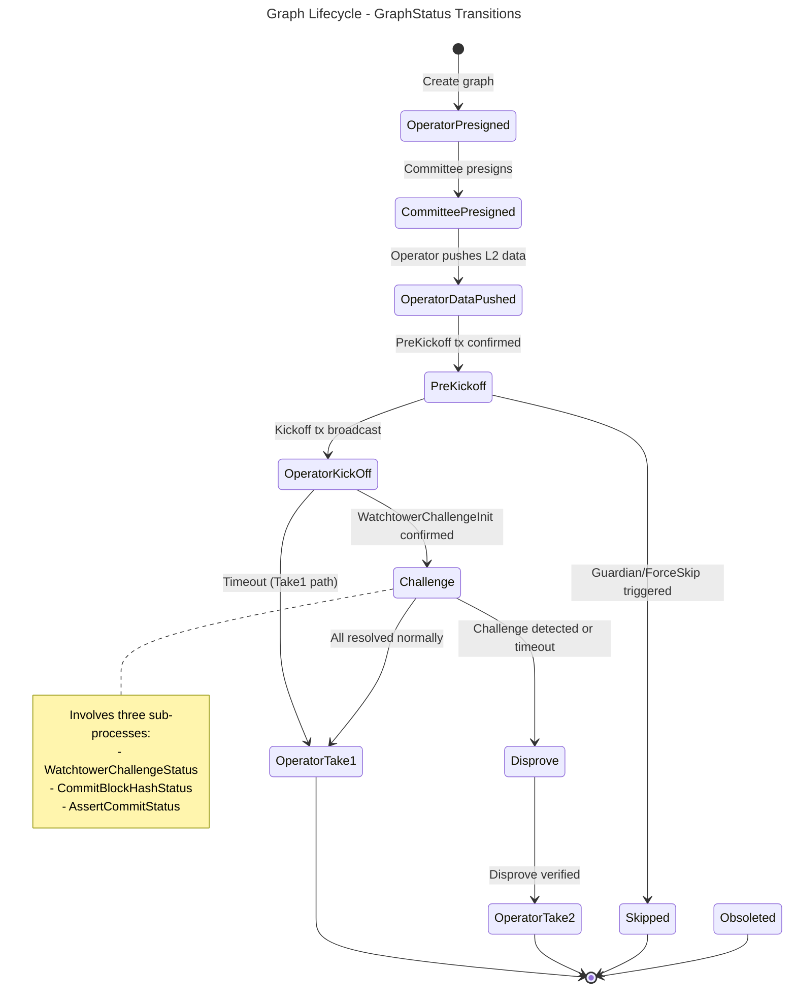
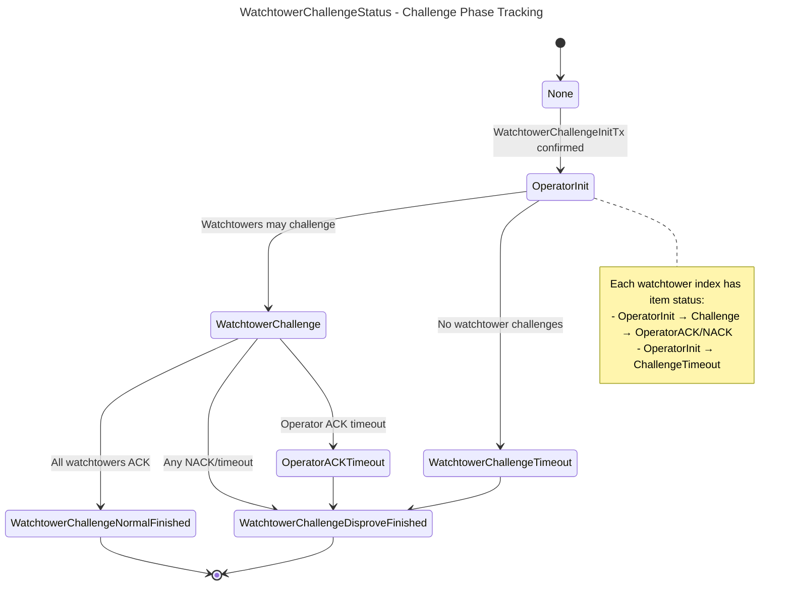
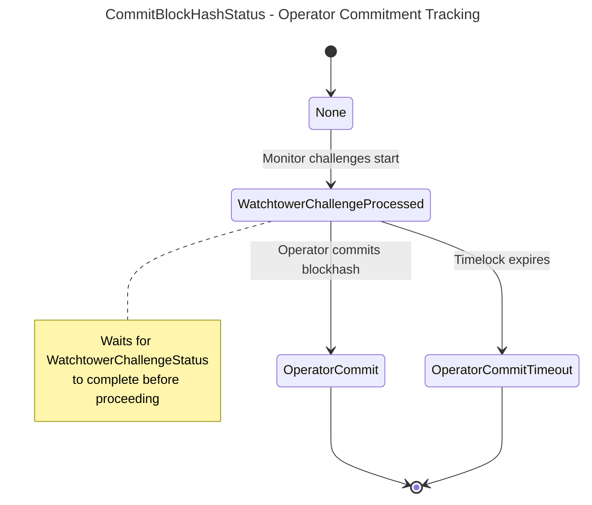
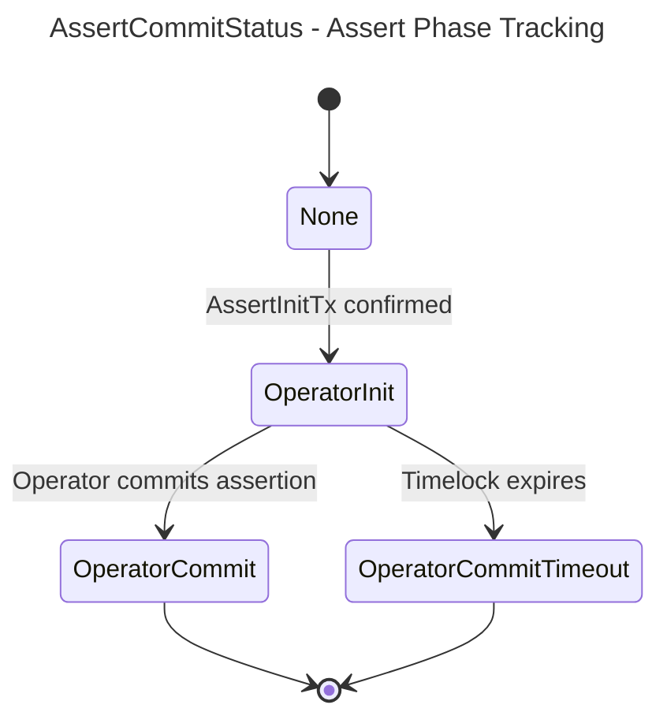
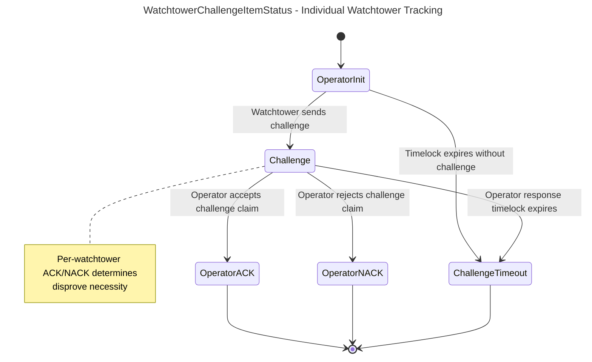

# Node

## Build

```bash
BITCOIN_NETWORK=regtest cargo build -r
```

## Graph State Machines

Based on `crates/store/src/schema.rs::GraphStatus` and `node/src/scheduled_tasks/graph_maintenance_tasks.rs`.

### Main Graph Status Transitions



### Challenge Phase: WatchtowerChallengeStatus

From `src/scheduled_tasks/graph_maintenance_tasks.rs::WatchtowerChallengeStatus`:



### Challenge Phase: CommitBlockHashStatus

From `src/scheduled_tasks/graph_maintenance_tasks.rs::CommitBlockHashStatus`:



### Challenge Phase: AssertCommitStatus

From `src/scheduled_tasks/graph_maintenance_tasks.rs::AssertCommitStatus`:



### Per-Watchtower Item Status

From `src/scheduled_tasks/graph_maintenance_tasks.rs::WatchtowerChallengeItemStatus`:



## Core Data Structures

### ChallengeSubStatus

From `src/scheduled_tasks/graph_maintenance_tasks.rs`:

```rust
pub struct ChallengeSubStatus {
    pub watchtower_challenge_status: WatchtowerChallengeStatus,
    pub commit_blockhash_status: CommitBlockHashStatus,
    pub assert_commit_status: AssertCommitStatus,
    pub disprove_type: Option<DisproveTxType>,
    pub disprove_index: i32,
}
```

### WTInitTxVoutMonitorData

From `src/scheduled_tasks/graph_maintenance_tasks.rs`:

```rust
pub struct WTInitTxVoutMonitorData {
    pub data_map: IndexMap<i32, WatchtowerChallengeItemStatus>,
    pub require_disproved_indexes: Vec<usize>,
    pub commit_blockhash_status: CommitBlockHashStatus,
    pub is_challenge_timeout_sent: bool,
}
```

Tracks per-watchtower status during challenge phase. If any item transitions to `Challenge`, `ChallengeTimeout`, or `OperatorNACK`, it's added to `require_disproved_indexes`.

## Key Implementation Files

- `src/action.rs` - Message dispatch via `recv_and_dispatch()`
- `src/scheduled_tasks/graph_maintenance_tasks.rs` - Main challenge monitoring logic:
  - `process_watchtower_challenge_monitoring()` - Track challenges
  - `process_commit_blockhash_monitoring()` - Track blockhash commitment
  - `process_assert_commit_monitoring()` - Track assert phase
- `src/utils.rs` - Graph refresh: `refresh_graph()` updates status based on Bitcoin state
- `crates/store/src/schema.rs` - `GraphStatus` and related enums
