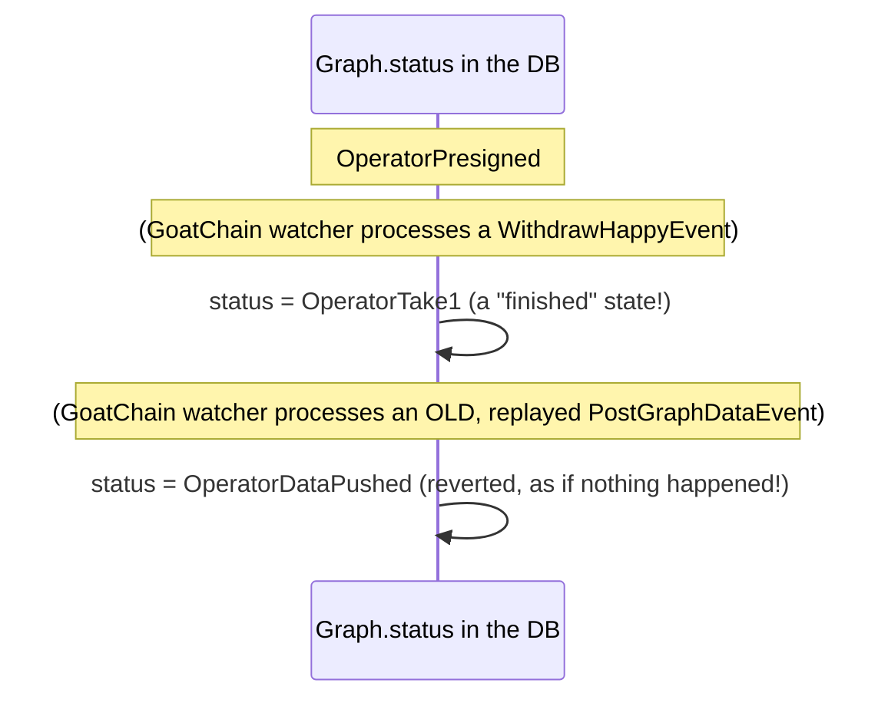

# `GraphLifecycle.tla`, explained without assuming you know TLA+

## What problem is this solving?

Every BitVM2 peg-out graph has a `status` field in the node's local database
(`OperatorPresigned`, `Challenge`, `OperatorTake1`, ...). Two **separate**
background jobs both update that field:

1. **The Bitcoin watcher** — periodically checks the Bitcoin chain and figures
   out where a graph is based on which transactions have confirmed.
2. **The GoatChain (L2) watcher** — a completely different background job
   that reacts to events on GoatChain and writes `status` too.

Neither job knows the other exists. They just both write to the same
database column, whenever they feel like it, on independent schedules.

That's the setup for a classic bug: **if two things write the same value
with no coordination, one can silently undo what the other just did.**
Concretely, we found that a stale or replayed GoatChain event could reset a
graph's status back to an earlier stage — even after that graph had already
finished (e.g. wipe out a `Disprove` record, or flip between the two
mutually-exclusive payout outcomes `OperatorTake1` and `OperatorTake2`).

**Important:** this is not "funds can be stolen." Bitcoin itself guarantees a
transaction output can only be spent once — that's not something this Rust
code has to enforce. What's actually at risk is the **node's own bookkeeping**
getting out of sync with reality: wrong status shown to users, wrong info fed
to whatever else in the code trusts that field.

## What is TLA+ actually doing here?

Think of TLA+ as a way to describe a system as: "here's every possible thing
that could happen next" — and then a tool (`TLC`) tries **every single
combination**, exhaustively, looking for one that breaks a rule you stated.
It's not a test with example inputs; it explores the *entire* space of
possible orderings of events, including the unlucky ones a human wouldn't
think to test.

That's exactly what's needed here: the bug only shows up under a specific,
easy-to-miss *interleaving* of the two watchers. A normal unit test would
probably never stumble onto it. TLC checks all of them.

## The model, piece by piece

```tla
VARIABLE status
```
There's exactly one thing being tracked: `status`, holding one of the 11 real
graph statuses.

```tla
ChainScanNext == \/ CommitteePresign \/ OperatorPushL2Data \/ ... \/ Disprove
```
This is "everything the Bitcoin watcher is allowed to do" — one line per real
transition (e.g. `OperatorKickOff -> Challenge`), copied from the actual
logic in `scan_graph_chain_state` (`node/src/utils.rs`).

```tla
GoatPostGraphData ==     status' = "OperatorDataPushed"
GoatWithdrawHappy ==     status' = "OperatorTake1"
```
This is the GoatChain watcher — modeled exactly as the *original* code
behaved: no left-hand condition at all. `status' = "OperatorTake1"` means
"can write `OperatorTake1` right now, no matter what `status` currently is."
That unconditional write is the bug.

```tla
Next == ChainScanNext \/ GoatRaceNext
```
At every step, TLC can pick *any* enabled action from *either* watcher — this
is what "no coordination between two independent jobs" looks like in the
model. TLC doesn't run them one-at-a-time in a fixed order; it tries every
possible order.

## The properties (the "rules" being checked)

- **`TerminalStatusesAreAbsorbing`** — once a graph reaches a finished state
  (`OperatorTake1`, `OperatorTake2`, `Skipped`, `Disprove`), it should never
  change again.
- **`NoConflictingWithdrawal`** — a graph can never flip between
  `OperatorTake1` and `OperatorTake2` (the two different payout outcomes).
- **`EventuallyTerminal`** — a graph should never get stuck cycling forever;
  it should eventually reach a finished state.

## The counterexample, in plain English

When TLC checks the *unguarded* version (matching the original code), it
finds this in under a second:



Two writes, zero coordination, and a "finished" graph silently un-finishes
itself. That's `TerminalStatusesAreAbsorbing` breaking, caught mechanically
instead of by someone noticing it in production months later.

## "Bug" vs "Fixed" — this is an audit, the fix isn't applied yet

This repo keeps **both** versions side by side:

| File | What it models | Should it pass? |
|---|---|---|
| `GraphLifecycleCoreOnly.cfg` | Bitcoin watcher only, no L2 race | ✅ yes |
| `GraphLifecycle.cfg` | Both watchers, **no guard** (the actual current code) | ❌ **fails — this is a live, unfixed bug** |
| `GraphLifecycleFixed.cfg` | Both watchers, **with the guard** (a verified fix design, NOT yet applied to the Rust code) | ✅ yes |

`GraphLifecycle.cfg` failing is not a historical artifact — it's an accurate
model of what `event_watch_task.rs`/`localdb.rs` do *right now*. `GraphLifecycleFixed.cfg`
passing proves a specific fix design is correct, so whoever applies it can do
so with confidence, but nobody has applied it yet. Once it is applied, this
table's "Should it pass?" column stays the same - `GraphLifecycle.cfg` should
then start being the odd one out, and should be re-labeled as the permanent
regression artifact it will become at that point.

## The proposed fix (what the "guard" means, once applied)

The fix isn't in this file — it targets `node/src/utils.rs`
(`update_graph_status_guarded`, which doesn't exist yet) and
`crates/store/src/localdb.rs`. Instead of "read the status, decide in Rust,
then write," the check would happen **as part of the same database
statement** that writes the new status — a SQL `WHERE status IN (...)`
clause, so there's no gap where another writer can sneak in between the
check and the write. `GraphLifecycleFixed.cfg` models
that atomic version, and it passes.

## How to actually run this yourself

See the "Formal verification (TLA+)" section in the repository root
`README.md` for setup + the full command. Short version, once TLA+ tools are
installed:

```bash
cd node/tla
java -jar ~/.local/share/tlaplus/tla2tools.jar -config GraphLifecycle.cfg GraphLifecycle.tla       # fails, on purpose
java -jar ~/.local/share/tlaplus/tla2tools.jar -config GraphLifecycleFixed.cfg GraphLifecycle.tla  # passes
```
